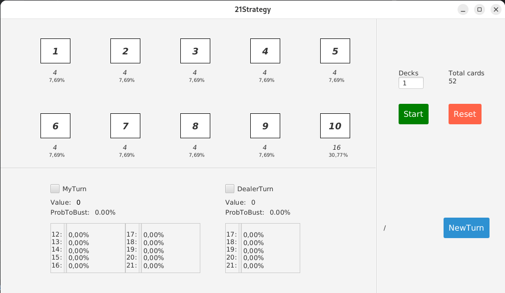

# 21Strategy - README

## Introduction 🃏
21Strategy is a software designed to calculate probabilities in the game of blackjack. By utilizing advanced probabilistic algorithms, the program suggests the optimal strategy to follow, taking into account the cards already played and the possible future values, both for the player and the dealer. A great tool for anyone looking to improve their technique and understand the dynamics of the game better.

## Disclaimer ⚠️
This software is developed exclusively for **educational** and **study** purposes. It is recommended to comply with local laws and regulations regarding gambling in your country or state. The software should not be used for malicious or illegal purposes. The author takes no responsibility for any misuse of the program. Remember: always gamble responsibly!

## Features ✨
- **Graphical User Interface (GUI):** A simple and intuitive interface that allows users to input data such as the number of decks in play, cards already dealt, the dealer's visible card, and when it’s the player’s turn.
- **Probability Calculation:** The software calculates and shows:
    - The probability of the player and the dealer going bust.
    - The possible values the dealer could have (from 17 to 21).
    - The future values for the player based on their current hand (from hand+1 up to 21).
- **Strategic Suggestions:** Provides the optimal strategy for the player based on the entered data, enhancing the chances of winning.
- **And more...**

## Technologies Used 💻
- **Java:** The main programming language.
- **JavaFX:** For creating a responsive and modern graphical user interface.
- **SceneBuilder:** To design and visually preview the user interface.
- **CSS:** For styling the GUI, making the user experience even more enjoyable.
- **Additional Libraries:** Various libraries for probability calculation and performance optimization.

## Contributions 🤝
Contribute to this project:
- **Bug Fixing:** Help fix any issues in the software.
- **GUI Improvements:** Enhance and simplify the user interface.
- **Feature Additions:** Implement new features and optimize existing ones.
  All contributions are welcome! We’re always looking for new ideas and solutions.

## License 📜
This project is licensed under the **MIT License**. You are free to use, modify, and distribute it as long as the license is included. Open source is for everyone! 

